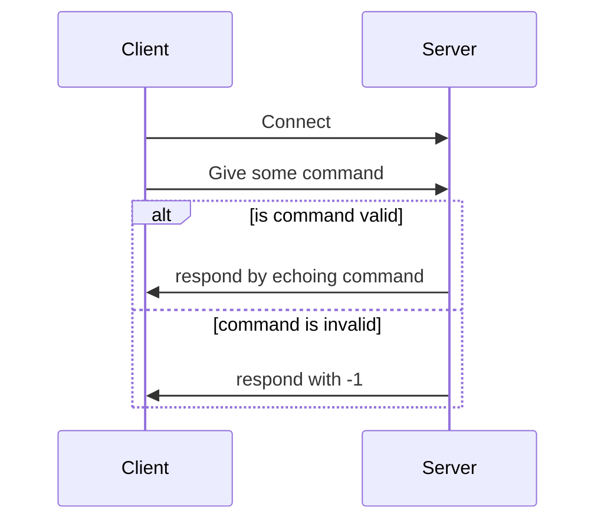
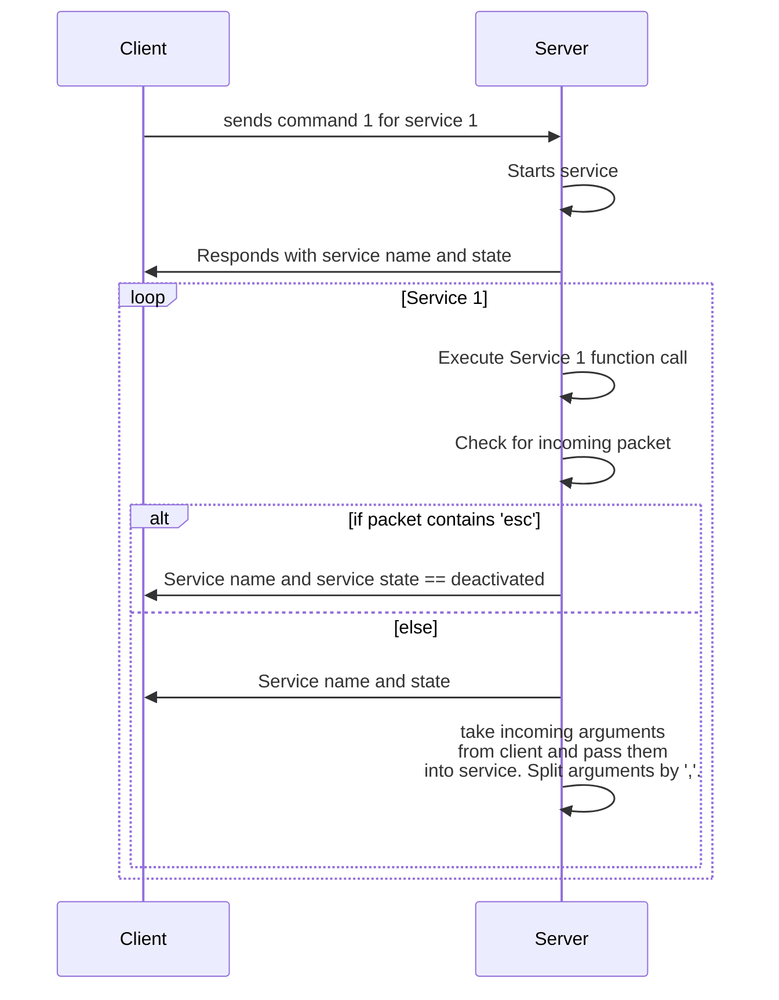

# UDP Client-Server Template
## Overview
The goal of this project is to give a basic starting point to creating a simple UDP client/server application. The original motivation for this project was to solve an issue. Trying to drive a service in the same thread as my GUI became a big problem. We needed to perform a calculation pretty quickly, it needed to be driven in a loop, and we at least need to be able to pass it user input. This template will allow for all of that. 

## Improvements
This template would be better if we could control the services in a thread. If we could get the threading to work with the 3 requirements stated above, we could run multiple services at the same time while managing them.  

## Diagrams
### How Server Handles Incoming Commands

### How Server Runs Service

